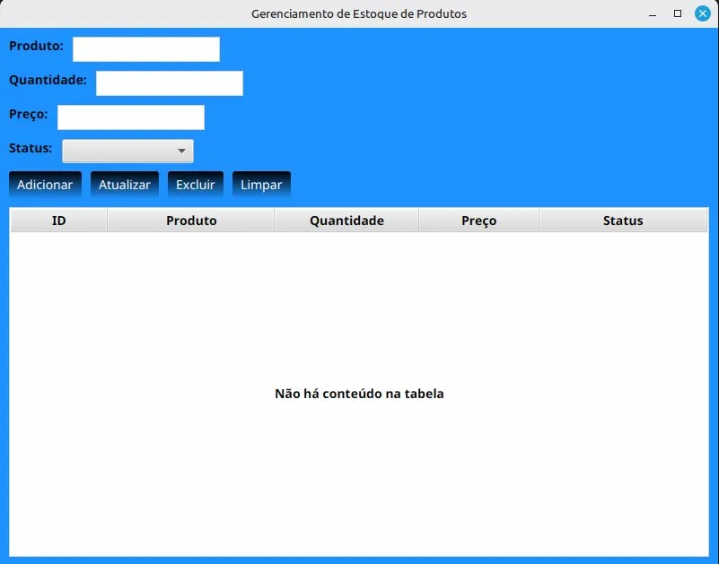

# 📦 Sistema de Gerenciamento de Produtos

Sistema CRUD completo para gerenciamento de produtos desenvolvido em Java com JDBC e SQLite.

## 🎯 Sobre o Projeto

Este projeto foi desenvolvido durante meu aprendizado de Java e JDBC, implementando um sistema backend completo com todas as operações CRUD (Create, Read, Update, Delete) para gerenciamento de produtos.

## 🖼️ Screenshots

### Interface Inicial


### Interface com Dados


## 🚀 Tecnologias Utilizadas

- **Java 22**
- **JDBC** (Java Database Connectivity)
- **SQLite** (Banco de dados)
- **IntelliJ IDEA** (IDE)

## ✨ Funcionalidades

- ✅ **Cadastro de produtos** - Inserção de novos produtos no banco de dados
- ✅ **Consulta por ID** - Busca de produtos específicos
- ✅ **Listagem completa** - Visualização de todos os produtos cadastrados
- ✅ **Atualização de dados** - Modificação de informações dos produtos
- ✅ **Exclusão de produtos** - Remoção de produtos do sistema

## 📂 Estrutura do Projeto
```
src/
├── ConexaoDB.java       # Gerenciamento da conexão com o banco de dados
├── CriadorTabela.java   # Criação automática das tabelas
├── Produto.java         # Classe de entidade (modelo de domínio)
├── ProdutoDAO.java      # Operações CRUD (Data Access Object)
└── Main.java            # Classe principal com testes
```

## 🗄️ Modelo de Dados

**Tabela: produtos**

| Campo      | Tipo         | Descrição              |
|------------|--------------|------------------------|
| id         | INTEGER      | Chave primária (auto)  |
| nome       | VARCHAR(100) | Nome do produto        |
| preco      | DECIMAL      | Preço do produto       |
| quantidade | INTEGER      | Quantidade em estoque  |

## 🛠️ Como Executar

### Pré-requisitos

- Java JDK 17 ou superior (testado em Java 22)
- SQLite JDBC Driver (incluído no projeto)

### Passos

1. **Clone o repositório:**
```bash
git clone https://github.com/haveneryck/sistema-produtos-jdbc.git
cd sistema-produtos-jdbc
```

2. **Abra o projeto no IntelliJ IDEA**

3. **Execute a classe Main.java**

O banco de dados SQLite será criado automaticamente na primeira execução.

## 💡 Conceitos Aplicados

- **Padrão DAO** (Data Access Object)
- **Conexão JDBC** com gerenciamento de recursos
- **Prepared Statements** (prevenção de SQL Injection)
- **Tratamento de exceções** adequado
- **Organização em camadas** (entidade, persistência, apresentação)

## 📚 Aprendizados

Este projeto me permitiu consolidar conhecimentos em:
- Manipulação de banco de dados com JDBC
- Implementação de operações CRUD
- Boas práticas de programação Java
- Gerenciamento de conexões e recursos
- Padrões de projeto (DAO)

## 👨‍💻 Autor

**Vinicius Oliveira Brito**

- GitHub: [@haveneryck](https://github.com/haveneryck)
- LinkedIn: [Vinicius Oliveira /haveneryck](https://www.linkedin.com/in/haveneryck)
- Localização: Montes Claros, MG

---

⭐ **Projeto desenvolvido como parte do aprendizado em Java e preparação para atuar como Desenvolvedor Java Júnior**
