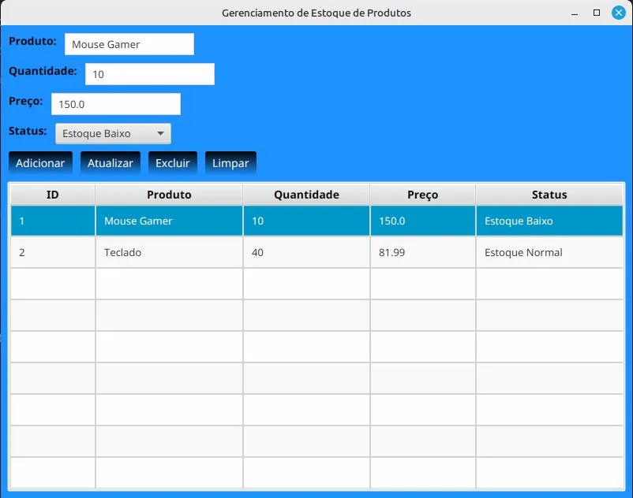

# 📦 Sistema de Gerenciamento de Produtos

Sistema CRUD completo para gerenciamento de produtos desenvolvido em Java com JDBC, JavaFX e interface estilizada com CSS.

## 🎯 Sobre o Projeto

Este projeto foi desenvolvido durante meu aprendizado de Java e JDBC, implementando um sistema completo de gerenciamento de estoque com backend (CRUD) e frontend (interface gráfica moderna).

## 🖼️ Screenshots

### Interface com Dados


### Interface Inicial


## 🚀 Tecnologias Utilizadas

- **Java 17+** (testado em Java 22)
- **JDBC** (Java Database Connectivity)
- **SQLite** (Banco de dados)
- **JavaFX** (Interface gráfica)
- **CSS** (Estilização profissional)
- **IntelliJ IDEA** (IDE)

## ✨ Funcionalidades

- ✅ **Cadastro de produtos** - Inserção de novos produtos no banco de dados
- ✅ **Consulta por ID** - Busca de produtos específicos
- ✅ **Listagem completa** - Visualização de todos os produtos cadastrados
- ✅ **Atualização de dados** - Modificação de informações dos produtos
- ✅ **Exclusão de produtos** - Remoção de produtos do sistema
- ✅ **Seleção na tabela** - Clique em um produto para editar
- ✅ **Interface estilizada** - Design moderno com CSS

## 📂 Estrutura do Projeto
```
sistema-produtos-jdbc/
├── src/
│   ├── ConexaoDB.java          # Gerenciamento da conexão com o banco
│   ├── CriadorTabela.java      # Criação automática das tabelas
│   ├── Produto.java            # Classe de entidade (modelo)
│   ├── ProdutoDAO.java         # Operações CRUD (Data Access Object)
│   ├── ProdutoGUI.java         # Interface gráfica JavaFX
│   ├── Main.java               # Testes do backend
│   └── styles-produtos.css     # Estilização da interface
├── screenshots/                # Capturas de tela
└── README.md                   # Documentação
```

## 🗄️ Modelo de Dados

**Tabela: produtos**

| Campo      | Tipo         | Descrição              |
|------------|--------------|------------------------|
| id         | INTEGER      | Chave primária (auto)  |
| nome       | VARCHAR(100) | Nome do produto        |
| preco      | DECIMAL      | Preço do produto       |
| quantidade | INTEGER      | Quantidade em estoque  |
| status     | VARCHAR(50)  | Status do estoque      |

## 🛠️ Como Executar

### Pré-requisitos

- Java JDK 17 ou superior (testado em Java 22)
- JavaFX SDK 22
- SQLite JDBC Driver (incluído no projeto)

### Configuração do JavaFX

1. **Baixe o JavaFX SDK:**
```bash
   wget https://download2.gluonhq.com/openjfx/22/openjfx-22_linux-x64_bin-sdk.zip
   unzip openjfx-22_linux-x64_bin-sdk.zip
```

2. **Configure no IntelliJ:**
   - File → Project Structure → Libraries
   - Adicione os JARs do JavaFX: `/caminho/para/javafx-sdk-22/lib`

3. **VM Options:**
```
   --module-path /caminho/para/javafx-sdk-22/lib --add-modules javafx.controls,javafx.fxml
```

### Executar

1. **Clone o repositório:**
```bash
   git clone https://github.com/haveneryck/sistema-produtos-jdbc.git
   cd sistema-produtos-jdbc
```

2. **Abra no IntelliJ IDEA**

3. **Execute ProdutoGUI.java** (interface gráfica)
   - Ou execute Main.java para testes no terminal

O banco de dados SQLite será criado automaticamente na primeira execução.

## 💡 Conceitos Aplicados

- **Padrão DAO** (Data Access Object)
- **Conexão JDBC** com gerenciamento de recursos
- **Prepared Statements** (prevenção de SQL Injection)
- **Tratamento de exceções** adequado
- **Organização em camadas** (entidade, persistência, apresentação)
- **Interface gráfica** com JavaFX
- **Estilização CSS** profissional
- **Observable Collections** para sincronização de dados

## 🎨 Estilização

O projeto utiliza CSS customizado com:
- Fundo azul dodger moderno
- Botões com gradiente e efeito hover
- Labels em negrito para melhor legibilidade
- Tabela estilizada com bordas e espaçamento
- Design responsivo e profissional

## 📚 Aprendizados

Este projeto me permitiu consolidar conhecimentos em:
- Manipulação de banco de dados com JDBC
- Implementação de operações CRUD completas
- Desenvolvimento de interfaces gráficas com JavaFX
- Aplicação de estilos CSS em aplicações desktop
- Boas práticas de programação Java
- Gerenciamento de conexões e recursos
- Padrões de projeto (DAO)
- Integração backend + frontend

## 🔄 Melhorias Futuras

- [ ] Validação de campos de entrada
- [ ] Sistema de busca/filtro de produtos
- [ ] Relatórios em PDF
- [ ] Gráficos de estoque
- [ ] Sistema de backup do banco
- [ ] Autenticação de usuários

## 👨‍💻 Autor

**Vinicius Oliveira Brito**

- GitHub: [@haveneryck](https://github.com/haveneryck)
- LinkedIn: [Vinicius Oliveira Brito](https://www.linkedin.com/in/haveneryck)
- Localização: Montes Claros, MG

---

⭐ **Projeto desenvolvido como parte do aprendizado em Java e preparação para atuar como Desenvolvedor Java Júnior**

💼 **Portfolio:** [github.com/haveneryck](https://github.com/haveneryck)
